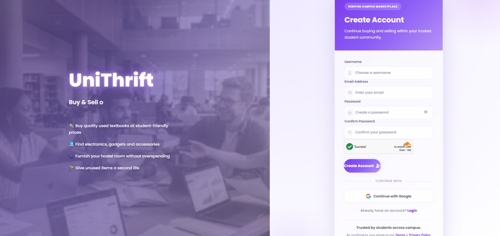
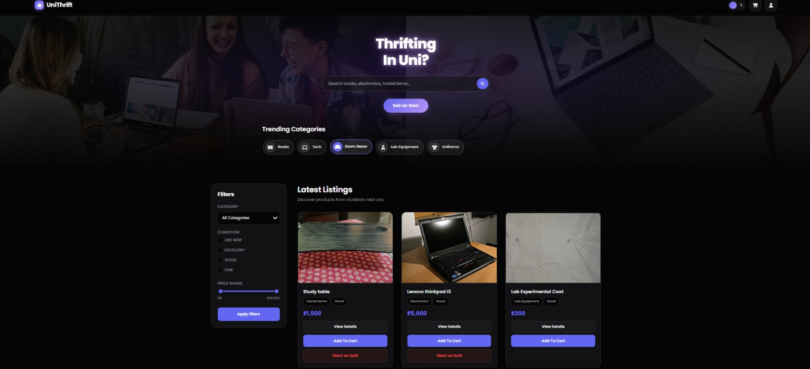
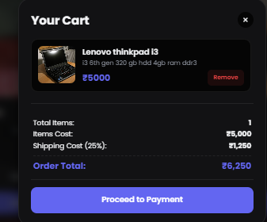

<div align="center">

# 🛍️ UniThrift

### Buy Smart. Sell Smarter. Sustain Together.

### India's AI-Powered Student Marketplace

[]()
[]()
[]()

## What is UniThrift

UniThrift is an AI-powered marketplace built exclusively for college students, enabling secure buying and selling of pre-owned items within trusted campus communities.

</div>

---

# Overview

Buying second-hand products is often difficult for students due to scams, fake listings, and the absence of a trusted student-only platform.
UniThrift solves this problem by creating a secure ecosystem where verified college students can buy and sell products confidently.
Unlike conventional marketplaces, UniThrift integrates **Google Gemini AI** to generate intelligent product insights, helping buyers make informed purchasing decisions while promoting sustainability and affordability.

Our platform combines:

* Student-only access
* AI-powered product analysis
* Verified seller profiles
* Secure authentication
* Buyer-Seller communication
* Sustainable circular economy

Whether it's textbooks, electronics, lab equipment, hostel essentials, furniture, bicycles or gadgets, UniThrift gives unused products a second life.

---
# The Issue

Every academic year, thousands of students purchase expensive products that are only needed temporarily.
Meanwhile, seniors often discard or struggle to sell perfectly usable items.

Current marketplaces present several challenges:

❌ Anonymous sellers

❌ Fake product listings

❌ No student verification

❌ Little trust between buyers and sellers

❌ No AI-assisted quality assessment

❌ High prices for essential items

As a result,

* Students spend more money.
* Useful products become waste.
* Trust in online resale platforms decreases.

---

# What we do to solve this issue

UniThrift creates a secure, student-exclusive marketplace where trust is built through verification and artificial intelligence.

### Our platform provides:

✅ Verified student identities

✅ Verified seller program

✅ Secure authentication using Supabase

✅ AI-generated product insights using Google Gemini

✅ Smart search and category filters

✅ Integrated buyer-seller communication

✅ Modern responsive interface

Instead of relying solely on seller descriptions, UniThrift leverages AI to analyze product listings and provide unbiased insights that help buyers evaluate products more effectively.
---

# How UniThrift is different from other websites

Unlike traditional marketplaces, UniThrift is specifically designed for campus communities.

| Traditional Marketplace | UniThrift                 |
| ----------------------- | ------------------------- |
| Anonymous Sellers       | ✅ Verified Students       |
| No AI Assistance        | ✅ Gemini AI Insights      |
| No College Verification | ✅ College ID Verification |
| Generic Marketplace     | ✅ Student-only Platform   |
| Limited Trust           | ✅ Verified Sellers        |
| No Sustainability Focus | ✅ Circular Campus Economy |

# KEY FEATURES

UniThrift is designed to provide a secure, seamless, and intelligent marketplace experience for college students.
---

## Secure Authentication

UniThrift uses **Supabase Authentication** to ensure that only registered users can access the platform.

### Features

* Email & Password Login
* Student Registration
* Google Sign-In
* Secure Session Management
* Protected Routes
* Password Visibility Toggle
* Modern Responsive UI

<p align="center">
  
</p>
---

## Student Registration

Every user creates an account before entering the marketplace.
The registration process includes:

* Username
* Email
* Password
* Google Sign Up
* Secure Authentication
* Future-ready Student Verification

<p align="center">
  
</p>

---

## Smart Marketplace

UniThrift provides a modern marketplace built specifically for students.

### Marketplace Features

* Smart Search
* Category Filters
* Condition Filters
* Price Filters
* Add to Cart
* Product Cards
* Beautiful Dark Theme
* Responsive Layout

Students can browse products ranging from

* Books
* Electronics
* Hostel Essentials
* Furniture
* Cycles
* Lab Equipment
* Uniforms
* Accessories

<p align="center">
  
</p>
---

## Detailed Product Page

Every product contains detailed information so buyers can make informed decisions.

### Product Information

* Product Images
* Product Description
* Price
* Delivery Date
* Warranty Information
* Payment Details
* Seller Details
* Student Verification Status
* Buyer Chat
* Reviews
* AI Product Insights

<p align="center">
  
</p>

---

## AI Product Insights (Powered by Gemini)

UniThrift integrates **Google Gemini AI** to increase transparency and trust in second-hand transactions.
Instead of relying only on the seller's description, Gemini analyzes the listing and generates objective insights for buyers.

### What the AI analyzes

* Product Images
* Product Description
* Price Reasonableness
* Product Condition
* Visible Damages
* Key Buying Points
* Overall Product Assessment

### AI Features

* Summarizes the product
* Detects inconsistencies
* Highlights important buying points
* Provides condition analysis
* Offers price-related observations
* Generates an easy-to-understand assessment

This enables buyers to make smarter purchasing decisions while improving trust across the marketplace.
<p align="center">
  
</p>

---

## Student Profile & Verification

Every user receives a personalized dashboard to manage their identity, listings, and verification status.

### Profile Features

* Student Dashboard
* College Information
* Address Management
* Profile Details
* Student Verification
* Seller Verification
* My Listings
* Account Status
* Quick Trading Tips

### Verification Hub

Students can upload:

* College ID Card
* PAN Card
* Payment QR Code

Once verified, users become trusted sellers within the UniThrift ecosystem.

---

## 🛡️ Admin Verification Panel

To ensure the highest level of trust and security, UniThrift includes a dedicated **Admin Verification Panel** for website administrators.

While most profile and document verification is streamlined, certain submissions may require human review if discrepancies or inconsistencies are detected.

### Features

* Manual verification of College ID cards
* Review of PAN card submissions
* Verification of payment QR codes
* Detection and handling of suspicious or incomplete documents
* Approve or reject verification requests
* Add remarks or reasons for rejection
* Request users to re-upload invalid or unclear documents
* Prevent fraudulent accounts from accessing seller privileges

### Why This Matters
Although AI helps automate product analysis and verification, sensitive identity documents require an additional layer of human oversight. The Admin Verification Panel ensures that every verified seller is authentic, maintaining a secure and trustworthy marketplace for all students.
This hybrid **AI + Human Verification** approach minimizes fraud while ensuring genuine users are never unfairly rejected due to image quality or document inconsistencies.
<p align="center">
  
</p>
---

## 💬Buyer–Seller Communication

UniThrift includes an integrated messaging system that allows buyers and sellers to communicate directly from the product page.

### Chat Features

* Secure conversations
* Verified user indicator
* Product-linked chat
* Faster negotiations
* Improved trust between buyers and sellers
---

## Smart Shopping Cart

The shopping cart provides a simple checkout experience.

### Cart Features

* Add Items
* Remove Items
* Shipping Cost Estimation
* Order Summary
* Total Amount Calculation
* Proceed to Checkout
<p align="center">
  
</p>
---

## Modern User Experience

UniThrift is designed with a modern UI that prioritizes usability and accessibility.

### Design Highlights

* Dark Theme
* Fully Responsive
* Purple Glassmorphism Design
* Smooth Animations
* Clean Navigation
* Desktop & Mobile Friendly
* Intuitive User Interface

Our goal is to make buying and selling feel as smooth as using a modern e-commerce platform while keeping the experience tailored for college students.

# Tech Stack Used

| Category                | Technology                       |
| ----------------------- | -------------------------------- |
| Frontend                | HTML5, CSS3, JavaScript          |
| Backend                 | Node.js, Express.js              |
| Database                | PostGreSQL                       |
| Authentication          | Supabase                         |
| Artificial Intelligence | Google Gemini API                |
| UI Design               | Glassmorphism, Responsive Design |
| Version Control         | Git & GitHub                     |
| Deployment              | Vercel / Render *(Planned)*      |

---

# System Architecture

```
                        UniThrift
                             │
                             ▼
                  HTML • CSS • JavaScript
                             │
                             ▼
                    Node.js + Express.js
                             │
            ┌────────────────┴────────────────┐
            ▼                                 ▼
      MongoDB Database               Supabase Authentication
            │                                 │
            └────────────────┬────────────────┘
                             ▼
                    Google Gemini API
                             │
                             ▼
             AI Product Insights & Verification
```
---

# AI Workflow

Google Gemini AI enhances transparency in every product listing.

```
Seller Uploads Product
            │
            ▼
Product Images + Description
            │
            ▼
      Google Gemini AI
            │
            ├──────────────► Product Summary
            │
            ├──────────────► Condition Analysis
            │
            ├──────────────► Damage Detection
            │
            ├──────────────► Key Buying Points
            │
            ├──────────────► Price Insights
            │
            └──────────────► Overall Assessment
                         │
                         ▼
          AI Insights Displayed to Buyers
```
---

# How We Use AI

UniThrift uses **Google Gemini AI** to improve buyer confidence and reduce fraudulent listings.

### Gemini analyzes

* Uploaded Product Images
* Product Description
* Product Condition
* Possible Visible Damage
* Price Fairness
* Key Buying Highlights
* Overall Product Assessment

Instead of replacing the seller's description, Gemini acts as an **independent assistant** that provides buyers with additional insights before making a purchase. This makes second-hand shopping safer, smarter, and more transparent.
---

# Security Features

Security is one of the core pillars of UniThrift.

### Authentication

* Secure Login
* Protected Routes
* Session Management
* Supabase Authentication

### Seller Verification

* College ID Verification
* PAN Card Upload
* Payment QR Verification

### Marketplace Safety

* AI-generated Product Insights
* Verified Student Profiles
* Verified Seller Badge
* Secure Buyer-Seller Communication

---
---

# Installation

## Clone the Repository

```bash
git clone https://github.com/Samriddha0207/UniThrift.git
```

Move into the project directory
```bash
cd UniThrift
```

---

## Install Dependencies

Backend

```bash
npm install
```

If your frontend is inside a separate folder

```bash
cd client
npm install
```

---

## Environment Variables not included (To be added)

## Run the Backend

```bash
node server.js
```

---

## Run the Frontend

```bash
npm run dev
```

---

## Access the Application

After both servers are running, open your browser and navigate to:

```
http://localhost:5173
```
---

# Performance Goals

UniThrift is designed with the following objectives:

* Fast page loading
* Responsive on all devices
* Secure authentication
* Intelligent AI assistance
* Scalable backend architecture
* Easy deployment for multiple colleges

# Business Model

UniThrift is designed to be a sustainable and scalable platform with multiple revenue streams while keeping the marketplace affordable for students.

---

---

## Campus Partnerships

Partnering with colleges enables:

* Official Campus Marketplace
* Hostel Clearance Sales
* College Merchandise
* Student Exchange Programs
* Campus Events Marketplace

---

## Transaction Services *(Future)*

A small convenience fee may be introduced on successful transactions after integrating secure online payments.

---

## Sponsored Promotions

Brands targeting students can advertise:

* Electronics
* Books
* Stationery
* Coaching Institutes
* Student Discounts
* Educational Services

---

## Future Revenue Opportunities

* AI-powered pricing recommendations
* Premium buyer memberships
* Campus ambassador programs
* Delivery partnerships
* Subscription-based analytics

---

# Impact in various domains

### Environmental Impact

* Reduce electronic waste
* Promote reuse of quality products
* Encourage sustainable consumption

### Student Impact

* Affordable education
* Lower living expenses
* Easier access to study materials
* Better accessibility to electronics

### Community Impact

* Trusted student-to-student transactions
* Stronger campus communities
* Increased transparency through AI

### Technological Impact

* AI-assisted product insights
* Reduced fraud
* Smarter buying decisions
* Better trust in second-hand commerce

---

# Roadmap

## Phase 1 ✅

* Student Marketplace
* Authentication
* Product Listings
* Seller Profiles
* Cart
* AI Product Insights
* Real-time Chat
* Ratings & Reviews
  
---

# Phase 2 - Future Scope

UniThrift aims to become India's largest student marketplace by expanding beyond individual campuses.

Future enhancements include:

* Razorpay/Stripe Payment Integration (Under Development)
* Location-Based Product Discovery
* AI-Based Price Prediction
* Personalized Product Recommendations
* Delivery Tracking
* Real-Time Notifications
* Native Android & iOS Apps
* Multi-College Marketplace
* Expansion to Universities Across India

---

# 👥 Team

## Team Members

### Md Rizwaan Rahaman - Backend Server Management + Scalability

###  Samriddha Chaudhury - Frontend, Debugging + Testing, System Design

---

# Acknowledgements

Special thanks to:

* **Google Gemini AI** for intelligent product analysis.
* **Supabase** for secure authentication.
* **MongoDB** for reliable data storage.
* **Node.js & Express.js** for backend development.
* Every student who inspired us to build a safer and more affordable marketplace.

---

# Support the Project

If you found this project useful,

Star this repository

Fork the project

Report issues

Suggest improvements

Every contribution helps make UniThrift even better.

---

<div align="center">

# 🛍️ UniThrift

### Buy Smart. Sell Smarter. Sustain Together.

### Building India's Most Trusted Student Marketplace

Made by

### Md Rizwaan Rahaman

### Samriddha Chaudhury

**⭐ Don't forget to star this repository if you liked our project! ⭐**

</div>
